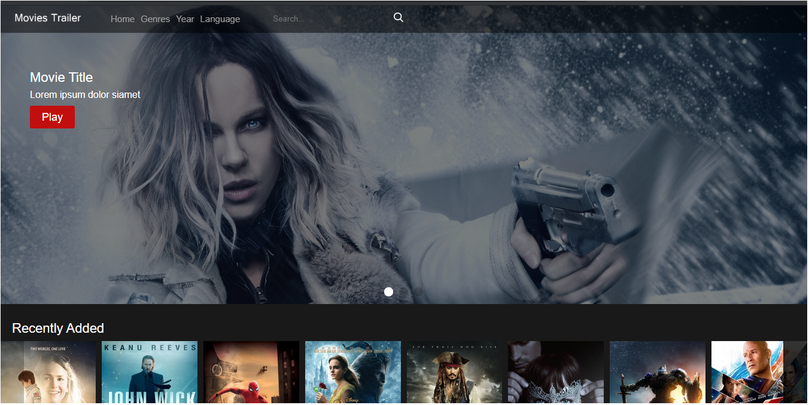
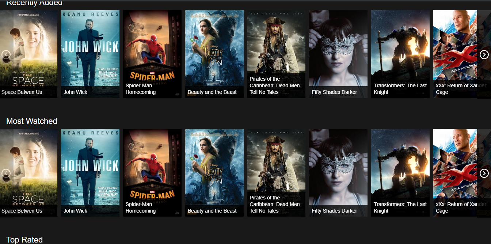
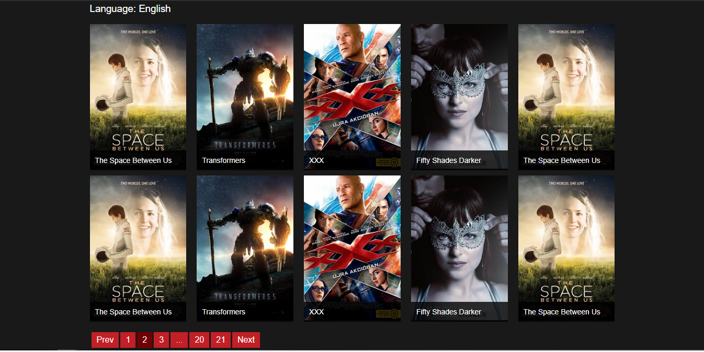

# django-imdb-clone
A small clone of imdb in django loaded with small features.
More Features will be added soon.

## Full Step to work:
* clone the project or download the project and extract. (choose either way)
* cd into the project folder i.e. `cd imdb-clone` or open cmd inside the folder.
* First install the requirements.txt file via command `pip install -r requirement.txt`
* Then cd into the scripts folder and activate. `cd scripts` -> `activate`
* cd back to imdb clone and cd into src.
* Run the command `python manage.py make migrations` & then `python manage.py migrate`
* Create a Super user for admin pannel. `python manage.py createsuperuser` (create one)
* Finally run the server via `python manage.py runserver` (open up in browser : 127.0.0.1:8000)

## Screenshots 

